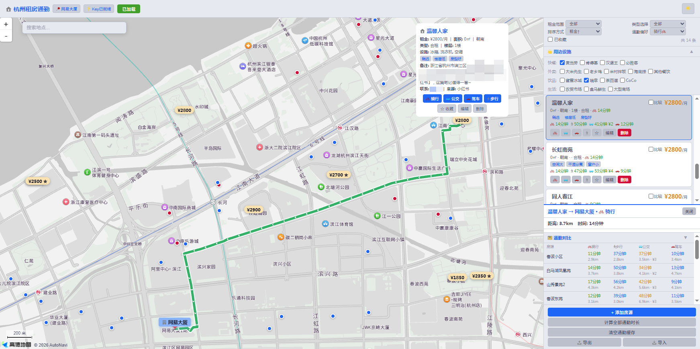
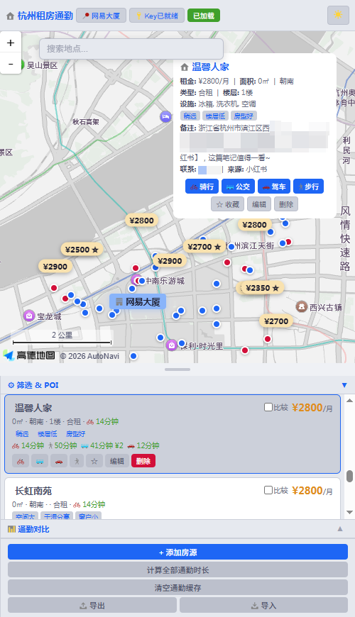
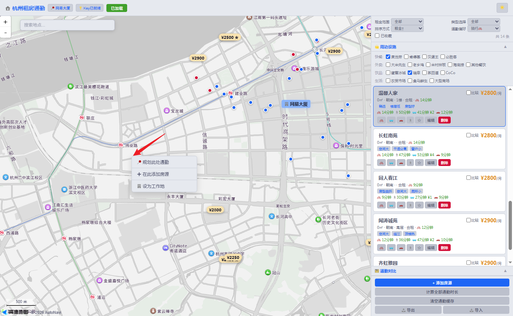
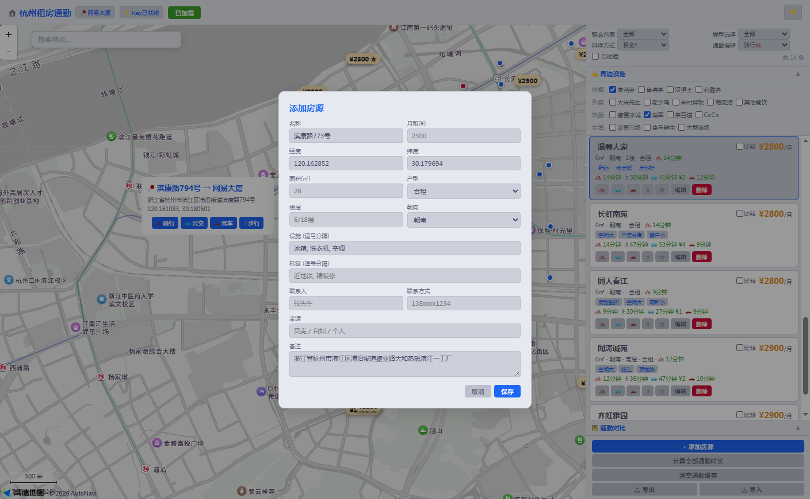

# 租房通勤工具

在地图上标记房源，一键计算骑行/公交/驾车/步行通勤路线，标注周边生活设施，帮你高效选房。

## 快速开始

1. 下载 `rental_commute.html`，双击打开
2. 前往[高德开放平台](https://lbs.amap.com/)注册，创建「Web端(JS API)」应用，获取 **Key** 和**安全密钥**
3. 填入顶部输入框，点击「加载地图」
4. 右键地图任意位置 →「设为工作地」
5. 点击「+ 添加房源」或右键地图 →「在此添加房源」
6. 点击「计算全部通勤时长」一键获取通勤数据

## 主要功能

- **房源管理**：添加/编辑/删除房源，支持导入导出 JSON、小红书文本提取
- **通勤计算**：骑行、步行、公交、驾车四种方式，逐步导航详情
- **通勤对比**：多房源通勤时间/距离横向对比
- **周边设施**：快餐、外卖、饮品、菜市场、商场等 POI 标注
- **筛选排序**：按租金、户型、通勤时间、距离筛选排序
- **收藏比较**：收藏心仪房源，多选并排比较
- **主题切换**：深色/浅色模式
- **移动端适配**：响应式布局，拖拽调整地图比例

## 数据存储

所有数据保存在浏览器 localStorage 中，不上传任何服务器。

## 链接

- 在线体验: [https://chick-mito.github.io/rental_commute/](https://chick-mito.github.io/rental_commute/)
